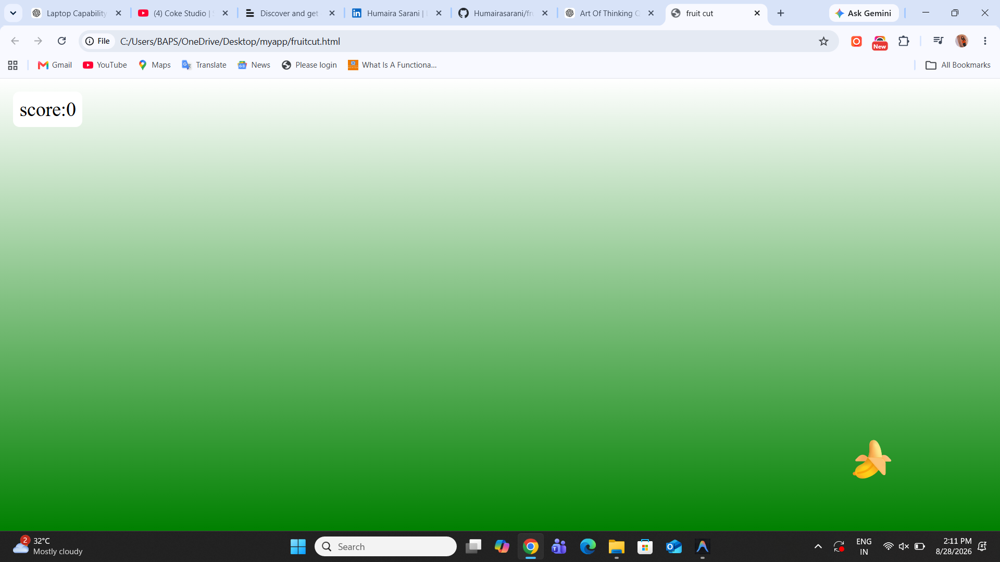

# 🍉 Fruit Cut Game

A simple browser-based Fruit Cut game built using **HTML, CSS, and JavaScript**.

## 🎮 How to Play

- Move your mouse over the fruits to cut them.
- Each fruit you cut increases your score.
- Try to get the highest score possible! 💥

## 🛠️ Technologies Used

- HTML5
- CSS3
- JavaScript

## ✨ Features

- Random fruit generation
- Animated fruits
- Mouse-based fruit cutting
- Score tracking
- Simple game interface

## 🚀 Live Demo

Coming soon...

## 📸 Screenshot
## 📸 Screenshot

